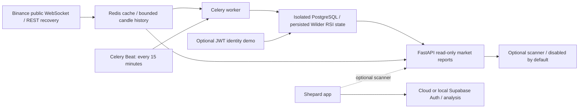

# Shepard Engine

[](https://github.com/cobanfurkanx/shepard-engine/actions/workflows/ci.yml)
[](docs/VALIDATION.md)

Independent Python market-data backend for [Shepard AI](https://github.com/cobanfurkanx/shepardai-crypto-advisor), with FastAPI, Redis, Celery and PostgreSQL. Streams public Binance data, recovers closed candles after disconnections and persists them through idempotent background jobs. No live orders.

## Engineering evidence

| Capability | Implementation | Evidence |
|---|---|---|
| Data pipeline | WebSocket ingestion, Redis cache, 15-minute Celery jobs, PostgreSQL | 1,995 real candles persisted; repeat delivery inserted zero duplicates |
| Independent identity | Optional JWT demo, Argon2id, refresh rotation and reuse revocation | PostgreSQL concurrency and session tests |
| SQL analytics | Complete 24-hour windows, RSI crossings and >=50% volume growth | [Query and EXPLAIN ANALYZE](docs/QUERY_PLAN.md) |
| Reliability | Freshness checks, bounded recovery, persistent volumes, restart recovery | [Runtime validation](docs/VALIDATION.md) |
| Quality | 30 tests with real PostgreSQL/Redis integration; 85% branch-inclusive coverage gate | Recorded 96.15% coverage; [passing Linux CI](https://github.com/cobanfurkanx/shepard-engine/actions/runs/37201014783) |

Measurements are dated validation results, not guaranteed latency or financial performance. The SQL benchmark used synthetic candles; the ingestion check used real public market data.



## Run locally

Python 3.12, uv 0.12.5 and Docker Desktop are required. On Windows move Docker's disk image to D before pulling images if C is constrained. Celery runs inside Linux containers.

```powershell
uv sync --locked --group dev
uv run python scripts/init_local.py
docker compose --env-file .env.local --profile engine up --build -d
```

The ignored `.env.local` is the engine's shared configuration. `init_local.py` generates random credentials and refuses to overwrite an existing file. The app keeps its own configuration. PostgreSQL/Redis volumes survive restarts.

API: `http://localhost:58080/docs`. Infrastructure readiness: `/health/ready`. Data-flow readiness: `/health/market` (may be unavailable during warm-up).

Once ingestion is connected, request the initial job instead of waiting for the next 15-minute tick:

```powershell
docker compose --env-file .env.local exec -T worker celery -A shepard_engine.worker:app call engine.persist_market
```

## Verify

```powershell
uv run python scripts/init_test_database.py
$env:RUN_INTEGRATION='1'
uv run pytest
uv run ruff check .
uv run ruff format --check .
uv build
```

Integration tests use the separate `engine_test` database and Redis DB 15. They refuse other database names. The default coverage gate is **85%**, including branches and all engine modules. A suite without infrastructure intentionally cannot satisfy that gate.

GitHub Actions workflow: `.github/workflows/ci.yml`. CI creates isolated PostgreSQL and Redis services and uses a disposable per-run database credential; contributors and fork PRs need no repository secrets. CI never connects to production. Local test evidence is in [VALIDATION.md](docs/VALIDATION.md).

## API

| Route | Purpose |
|---|---|
| `GET /health/live` | Process liveness |
| `GET /health/ready` | PostgreSQL and Redis readiness |
| `GET /health/market` | Ingestion and worker freshness |
| `GET /v1/market/ticker/{symbol}` | Fresh allowlisted ticker, or 503 |
| `GET /v1/market/top-coins` | Up to five RSI-crossing / volume-growth matches |
| `POST /v1/auth/register`, `/login`, `/refresh`, `/logout` | Optional independent identity demo |
| `GET /v1/auth/me` | JWT and active-session protected user endpoint |

The report counts transitions from RSI >=30 to <30 over the latest complete 24-hour window. Quote volume must grow >=50% relative to the previous complete window. Both windows require 96 distinct closed 15m candles. This is descriptive analytics, not a buy/sell recommendation. An empty result is valid.

## Identity boundary

`ENGINE_IDENTITY_ENABLED=false` by default. To run isolated auth tests or demos, enable it and supply a random `ENGINE_JWT_SECRET` of at least 32 characters. Passwords use Argon2id; refresh tokens are random and stored as SHA-256 hashes. JWTs expire within 15 minutes and refresh families within seven days. Rotation uses PostgreSQL row locks; reuse commits family revocation before returning 401, invalidating access tokens too.

Concurrent use of the same refresh token is treated as reuse: exactly one rotation wins and the resulting family is then revoked. Clients must serialize refresh requests and require a fresh login after lost/replayed refresh responses. This deliberate strict policy is covered by concurrency tests.

Tokens are returned as JSON for API demonstration. This module does not implement browser cookie sessions, email verification, password reset or Supabase migration; keep app authentication on Supabase.

## Relationship to the hybrid app

The app's hosted version uses Cloud Supabase; its local development mode uses a Docker-hosted Supabase stack. This independent engine is a separate optional market-data service, not a replacement for the app's Auth or account database. Local and Cloud app accounts are separate; this engine's optional identity demo is separate from both.

The app also implements validated free-tier LLM fallback across Gemini, NVIDIA, OpenRouter and Groq. That router runs in the app's Edge Functions, not this engine. See the [hybrid guides](https://github.com/cobanfurkanx/shepardai-crypto-advisor/tree/main/docs) and [free LLM guide](https://github.com/cobanfurkanx/shepardai-crypto-advisor/blob/main/docs/FREE_LLM_FALLBACK_TR.md).

## Security and disclosure

Only public market data belongs in this repository. Runtime credentials are generated locally and excluded from Git; `.env.example` contains placeholders. See [SECURITY.md](SECURITY.md) for deployment boundaries and private vulnerability reporting.

## Operations and boundaries

See [OPERATIONS.md](docs/OPERATIONS.md), [query-plan evidence](docs/QUERY_PLAN.md) and [source references](docs/SOURCES.md). Compose exposes ports only on localhost, uses non-root read-only engine containers, resource limits, persistent volumes and Redis authentication. It is a local deployment definition; internet hosting needs a TLS gateway, trusted-proxy policy, backups and a separate runtime DB role.

The optional app scanner is behind `VITE_ENABLE_ENGINE_SCANNER=false`. Enabling it requires an explicit HTTPS engine URL (localhost accepted for development) and matching CORS origin. It sends no Supabase JWT or cookies. Supabase usage limits remain applicable to existing app features.
